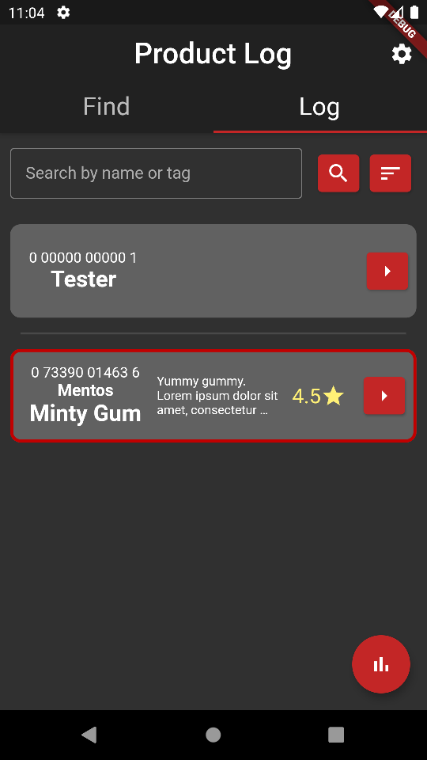
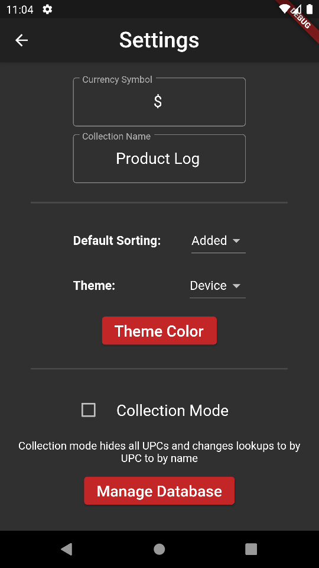
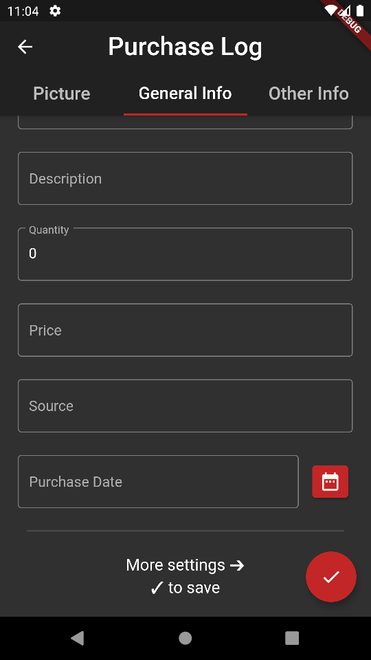

# Product Log

A cross platform mobile application written using the flutter SDK. Allows you to document and log purchases stored on a local SQLite database. Contains features allowing personalization and ease of use. 

# Products
Users can store product information to be recalled at any time. Users can scan barcodes, enter UPCs, or simply add products dynamically. Collection mode removes UPCs if desired. Stored product information can include ID, image, name, manufacturer, description, quantity, price, source, site link, rating, favorited, purchase date, and product tags. 

# Getting Started

This application is not yet on the Google Play store or iOS app store, though I plan to release it soon. It will stay open source even when it is published. You can compile the code yourself using flutter/Android Studio, or a debug APK is located in the build folder.

# Images

  

  

  

  

  

 

# License
Published under the MIT License.
